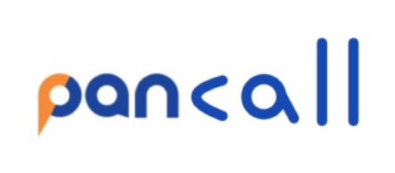
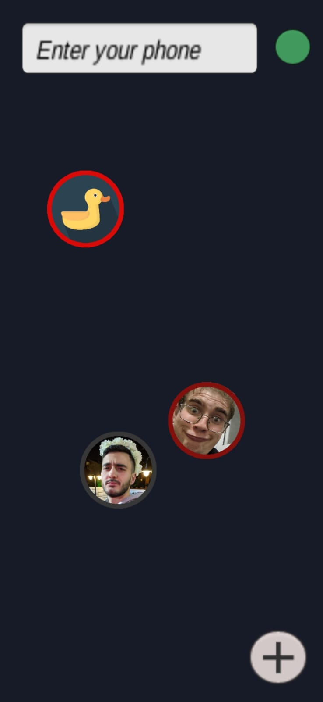
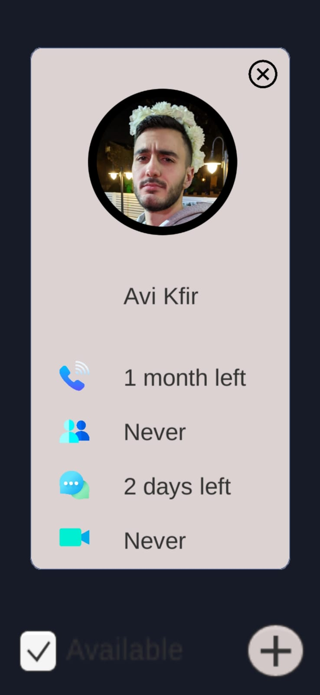
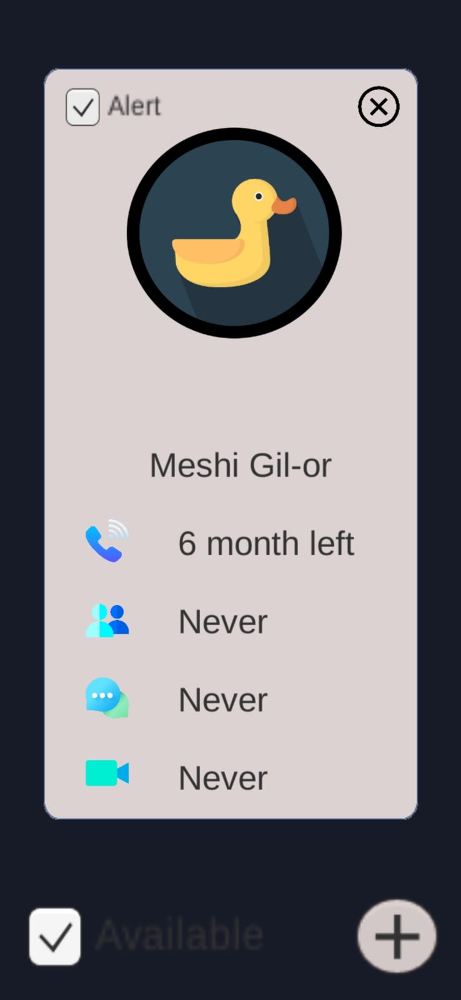
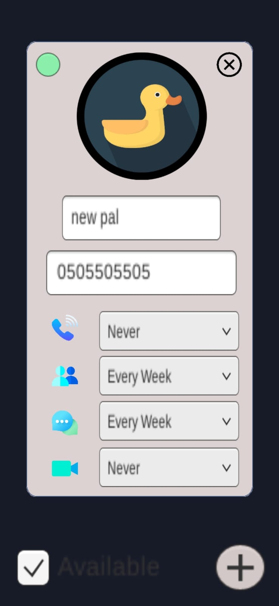

<h1 align="center">
  
  
 

  </h1>
<h3 align="center">  
  
  PanCall - Let those who matter into your life.
  </h3> 

## General

This mobile app was built as part of the 2022 Huji Hackathon event. As the Hackathon was focused on Productivity, this application is aimed to help with one of today's biggest everyday life issues - keeping in touch with those who matter to us the most.
In today's fast-paced world, it is very difficult to remember and manage things such us who we want to call or meet and when we can separate time for them. In addition, sometimes when we finally get our minds set on contacting someone, this person can be unavailable, and before we know it - we forget that we wanted to contact that person.

Our app helps by letting the user easily add contacts to an infinite space which allows visual organization as the user wishes - for example by different groups of family members or social circles. For each contact, the user can set reminders for when and how frequent to call, text or meet with him/her, and respectively receive notifications when the time to make a call/appointment is due. The user can also set an alarm for when the contact is free for a conversation.
  
## Screenshots

 
 
 
 

## Teammates 
- Ohad Klein
- Eitan Leviev
- Ethan Glick
- Aviel Raclaw
- Avi Kfir
